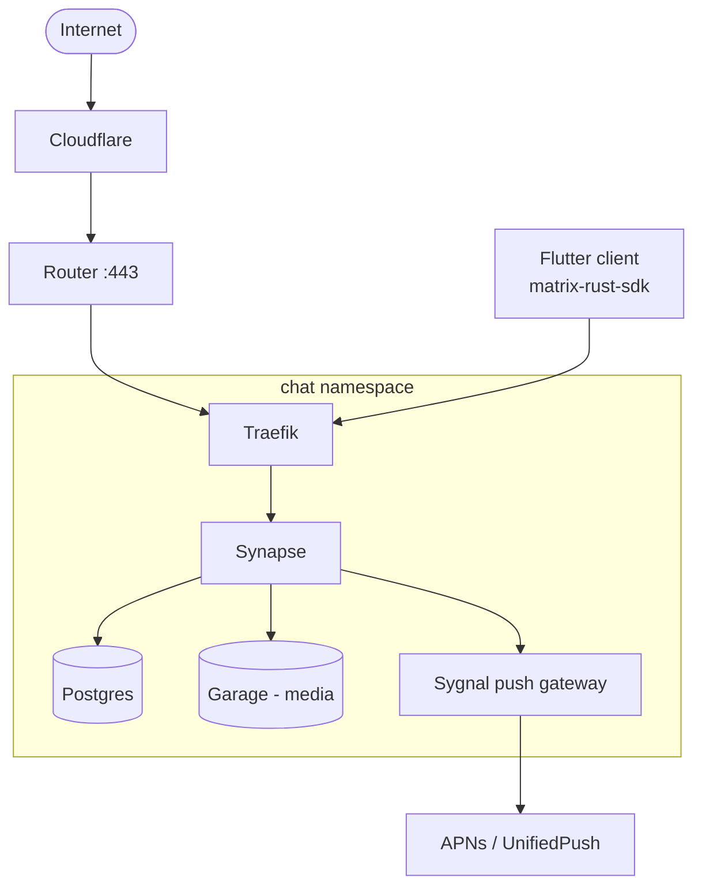

# r16a-chat

> Status: Design phase

Swiss-made, self-hosted, end-to-end encrypted messaging app. Built in response to the EU's expanding
message-scanning legislation (Chat Control). Self-hosted alternative to Signal (basically American) / WhatsApp (American) /
Telegram, hosted and operated in Switzerland. Long-term goal: a real alternative for humans who want
their messaging outside both US jurisdiction and EU scanning mandates, backed by Swiss data protection
law.

---

## What it does

- End-to-end encrypted messaging
- Operator (me) has no technical means to read message content
- Self-hosted on r16a infrastructure
- Minimal metadata retention
- Built on the Matrix protocol — audited crypto, not homegrown

## Stack

| Layer | Choice |
|---|---|
| Protocol | Matrix (Olm/Megolm via `vodozemac`) |
| Homeserver | Synapse |
| Client | Flutter + `matrix-rust-sdk` |
| Database | PostgreSQL |
| Media storage | Garage |
| Push | Sygnal (Matrix's push gateway) + UnifiedPush/APNs, silent payloads only |
| Ingress | Traefik + cert-manager, existing r16a-cloud pattern |

## Architecture

## What it protects against

- Bulk/warrantless message scanning
- Network traffic analysis
- Single device compromise
- Server compromise
- Legal compulsion of the operator (nothing to hand over but ciphertext)

Not in scope: nation-state-level endpoint compromise, anonymity from the operator (account existence and
connection timing are visible to the server), user-side leaks after decryption.

## Trust

- Plain-language security/privacy page
- `security.txt` with real disclosure contact
- Warrant canary
- Operated under Swiss data protection law (nFADP)

## Roadmap

1. Synapse + Postgres, local media — validate deployment
2. Garage for media storage
3. Flutter MVP: login, 1:1 encrypted chat, device verification
4. Push notifications
5. Media/attachments
6. Group chats
7. Desktop client (Tauri)
8. Trust/transparency layer

## Open questions

- Synapse vs. Dendrite at scale
- Key backup: opt-in or off by default
- Garage migration sequencing with r16a-cloud
